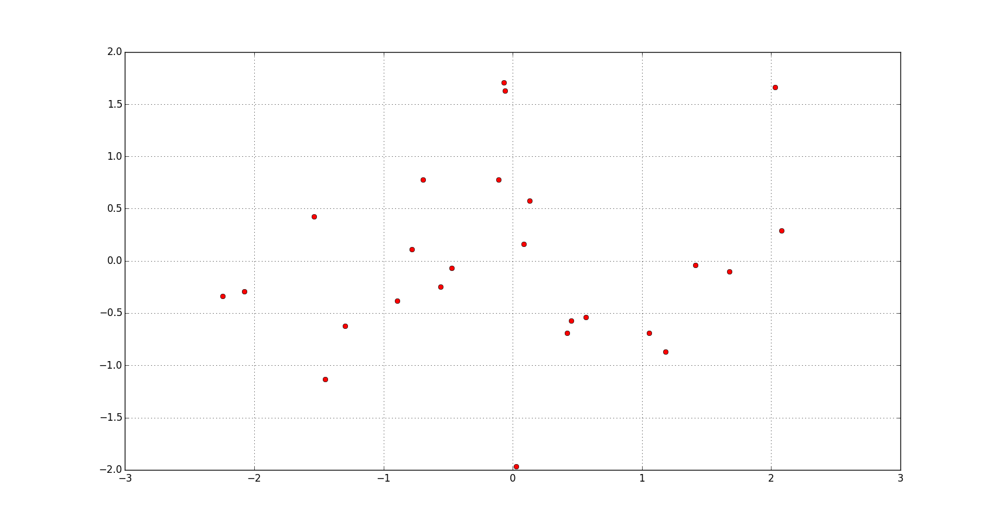
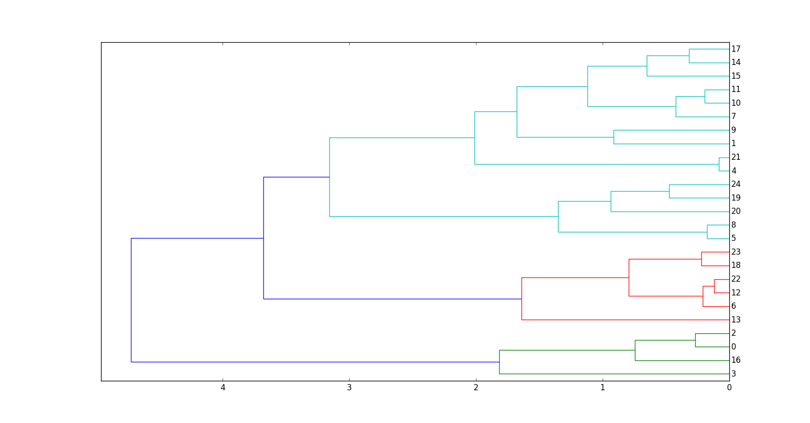

# Dendrogram. How to draw.

## Description

It's one of the clustering methods using [hierarchical clustering](https://en.wikipedia.org/wiki/Hierarchical_clustering).
We are going to use [special Scipy library](https://docs.scipy.org/doc/scipy/reference/cluster.hierarchy.html) for Python where you can find
useful function for clustering analysis saving your time. 
This special Scipy library in [GitHub.](https://github.com/scipy/scipy/blob/master/scipy/cluster/hierarchy.py)

>We are going to use this 2 data from this [project](https://github.com/rcv911/Cluster_generation) but changing some parameters: 



## Algorithm

+ So, we have distance matrix
```python
	d = sch.distance.pdist(X) # import scipy.cluster.hierarchy as sch
```
or manually (using Euclidean distance)
```python
	for i in range(N):
		for j in range(i+1, N):
			d[j, i] = d[i, j] = (sum((X[i, :]-X[j, :])**2))**0.5
```

> It's important. You can choose any of the metrics in Python function 
[scipy.cluster.hierarchy.distance.pdist()](https://docs.scipy.org/doc/scipy/reference/generated/scipy.spatial.distance.pdist.html)

+ We know the distances between each pair of points. We assume each point is a cluster and we starts to combining them. 
> Important. We combine **only two** of the cluster at each step. **Not the points**. One cluster shifts as a whole to another cluster.

+ 2 stopping criteria:
  + you achieved critical distance.
  + you have the right number of clusters

## Results
> dendrogram for the first test data with 1 cluster

> dendrogram for the second test data with 3 clusters


## Learn more

- [Wiki](https://en.wikipedia.org/wiki/Dendrogram)
- [Wiki2](https://wiki2.org/en/Dendrogram)
- [Hierarchical Clustering/Dendrograms](https://www.ncss.com/wp-content/themes/ncss/pdf/Procedures/NCSS/Hierarchical_Clustering-Dendrograms.pdf)

## Installation

You can use [Python](https://www.python.org/) with data package: [Anaconda](https://www.anaconda.com/) or [Miniconda](https://conda.io/miniconda).
There's another way - use [Portable Python](http://portablepython.com/). Also you can use whatever IDE for Python.

## License

Free